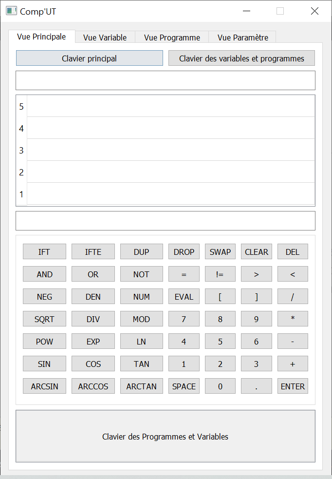

# Reverse Polish Notation (RPN) calculator

Scientific calculator using Reverse Polish Notation. 

## Prerequisites
- Qt

On Linux, the following would install all the dependencies you need for building the project:

```
sudo apt install cmake g++ ninja-build
jurplel/install-qt-action@v2
```


## Building

### Building using CMake:

```
mkdir build && cd build && cmake -G "Ninja" ../ && ninja
./UTCalculateur
```

### Building using Qt:

Open the file `CompUT.pro` in QtCreator and build the project directly in QtCreator GUI.

## User interface




